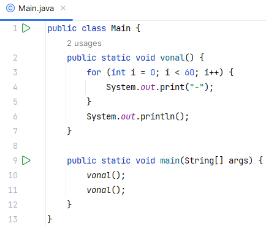
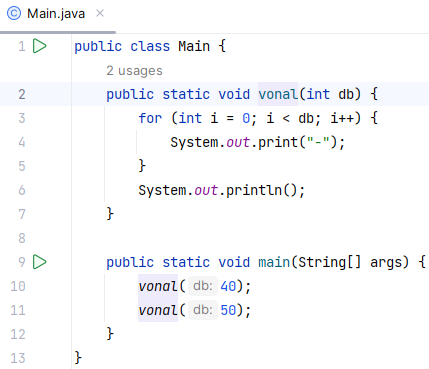
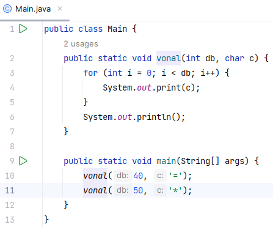
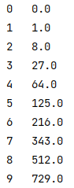
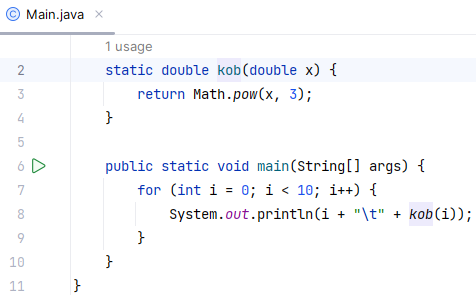
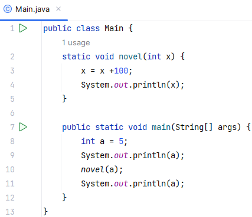
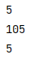

# 21. Metódusok 1.

## Vonal készítés

Készítsünk programot, amely húz két vízszintes vonalat! A vonalak 60 darab mínuszjelből álljanak!

Ha valamit többször is el kell végezni a programban, akkor sem szeretnénk többször elkészíteni, vagy másolni a kódját. Sokkal jobb lenne, ha csak egyszer kellene megírni, és utána használni, ahol szükséges. Erre valók a metódusok. (Egyes programozási nyelvekben függvényeknek vagy eljárásoknak is nevezik őket.)

Az eddigi programokban csak egy metódus van, a main(). A programok futtatásakor automatikusan ez indul el. Ebben a programban készítünk egy másik metódust is vonal() néven, és a main() metódusból meghívjuk (kétszer is).

A vonal() metódus 60 darab mínuszjelet fog kiírni egy sorba.

Nézzük a program kódját:

A vonal() metódust a main() metódus elé írtuk (2-7. sor), de állhatna utána is, a sorrend tetszőleges (ez nem minden nyelvben van így).

A metódus definíciója a static szóval kezdődik. Hogy miért, arról később lesz szó. Egyelőre írjuk oda minden metódus elé.

A void szó azt jelzi, hogy ez a metódus nem számol ki, nem ad vissza semmilyen értéket. Ha lenne ilyen érték, annak a típusát kellene ide írni.

A vonal a metódus neve, és utána ki kell tenni a zárójeleket.

A metódus utasításai (a ciklusok és az elágazások utasításaihoz hasonlóan) kapcsos zárójelek közé kerülnek.

A vonal() metódusban kiírunk 60 darab mínuszjelet, majd egy soremelést.

A main() metódusban meghívjuk a vonal() metódust. Ilyenkor végrehajtja a vonal() metódus utasításait, majd folytatja a main() metódust a következő utasítással.

Készítsd el a programot (*rajzol*), és próbáld ki!

## Paraméterek

Most különböző hosszúságú vonalakat szeretnénk rajzoltatni. Ehhez úgy kell módosítanunk a vonal() metódust, hogy meg lehessen neki adni a vonal hosszát, és ennek megfelelő számú mínuszjelet írjon ki.

Ezt így lehet megoldani:

A 2. sorban a zárójelek között megadunk egy paramétert (típussal és névvel): int db

Ezután a vonal() metóduson belül ez úgy használható, mint egy változó (de a metóduson kívül nem létezik!). A for ciklusban ezt adjuk meg határként.

A main() metódusban a vonal hívásakor zárójelben meg kell adnunk a db paraméter értékét. Ez tetszőleges kifejezés lehet, de típusának meg kell egyeznie a paraméter típusával (vagy átalakíthatónak kell lenni arra a típusra)!

Végezd el a módosításokat, és próbáld ki a programot!

Azt is szeretnénk megadni, hogy milyen karakterből készüljön a vonal. Ezért szükség van még egy paraméterre a vonal metódusban:

A metódusok paramétereinél a zárójelek között, vesszővel elválasztva akárhány paramétert megadhatunk. Csak arra kell vigyázni, hogy mindegyiknek külön megadjuk a típusát (akkor is, ha egyformák), és a híváskor gondoskodjunk a megfelelő számú és típusú paraméterről. Ezeket ugyanolyan sorrendben kell megadnunk, mint ahogy a paraméterlistában szerepelnek.

Próbáld ki ezt a változatot is!

## Visszaadott érték

Készítsünk programot, amely kiírja a 0…9 számok köbeit! A számok köbeinek kiszámításához készítsünk metódust! Így a főprogram egyszerűbb, áttekinthetőbb lesz.

Minta:

A kob metódus abban fog különbözni az eddigi metódusoktól, hogy vissza fog adni egy értéket: a kapott szám köbét.

Ehhez a metódus definíciójában a void helyett a visszaadott érték típusa (double) szerepel. Ezen kívül kell a metódusba legalább egy return utasítás, amellyel meghatározzuk a visszaadott értéket.

Nézzük a megoldást:

Figyeld meg a 3. sorban a return utasítást! Ebben adjuk meg a visszaadott értéket.

A program a visszaadott értéket a 8. sorban a kiírásba illeszti be.

Megjegyzés: A metódusunk double típusú értéket vár, mi pedig int típusúval hívjuk meg. Ez nem probléma, mert a Java automatikusan át tudja alakítani. (Ez nem minden adattípusnál van így. Fordítva például nem működne.)

Készítsd el és próbáld ki a programot!

Megjegyzések:

1.  Azokat a metódusokat, amelyek visszaadnak valamilyen értéket, általában egy értékadó utasítás jobb oldalán hívjuk meg, és a kapott értéket a program behelyettesíti a kifejezésbe.   
    Azokat a metódusokat pedig, amelyek nem adnak vissza értéket, önállóan, külön utasításként szoktuk meghívni.
2.  **Fontos!** Ha a metódus hívásakor parméterként egy változót adunk meg, és a metódus belsejében módosítjuk a paraméter értékét, ez az eredeti változót nem módosítja!  
    Nézzünk egy példaprogramot!  
      
    Figyeld meg, hogy hiába adunk hozzá 100-at a novel metódus paraméteréhez, a főprogramban az a változó értéke nem változik meg!  
    
